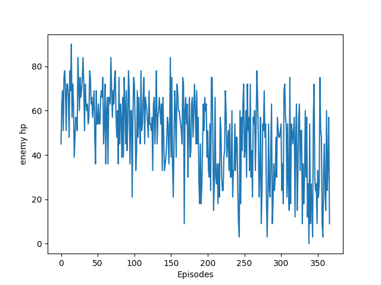
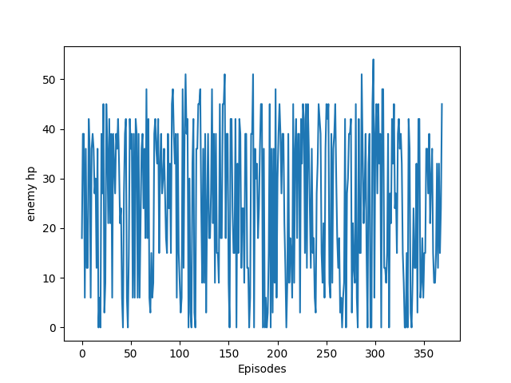

#### About
This is a project of creating a Starcraft 2 bot applying reinforcement learning

You can find three agents applied with three different algorithm: DQN, DDPG, and NEAT. There is also a scripted bot avaialbe.

All the mini maps used in this project can be found in the maps folder <br>
You can also find some pretrained models in the models folder

#### Demo
[YouTube Video Link](https://www.youtube.com/watch?v=piA92hvU7WY&feature=youtu.be)

#### Environment:
>Python 3 

>Tensorflow 1.8.0

>Neat-python 0.92

#### Installation
1. Clone this repository
```
git clone https://github.com/zxcvbnmditto/StarCraft2-Happy-Kitting.git
```
2. Install pysc2 manually (pysc2 just got updated so pip3 doesn't give you the latest version yet) 
```
Find the folder where you python3 package is and download/replace the pysc2 folder from 

https://github.com/deepmind/pysc2
```
3. Install the required packages if needed using pip
```
pip3 install <package-name>
```
4. Move the HappyKiting3V2.SC2Map to the Starcraft 2 minimap folder.
```
Application/StarCraft II/Maps/mini_games (MacOS)
~/StarCraft II/Maps/mini_games (Linux)
```

#### Running
1. Navigates to the directory that you are interested tha most and run the following line in the terminal
```
 python3 -m main
```

#### Results
We will evaluate our result using leftover enemy hp in each episodes and calculate the average.  

Rank by winning rate: 
> scipted (99.44%) > dqn (7.59%) > ddpg (0.27%) > neat(0%)

Rank by average leftover sum of enemy's hp:
> scripted (0.025) > dqn (25.056) > ddpg(49.275) > neat(55.74)

#### Scripted
<p align="center">
  <h2 align="center">Overview of change of enemy hp throughout 500000 steps <br>
   <br>
  <h2 align="center"> Overview of change of enemy hp throughout 500000 steps <br>
  
  <h2 align="center"> Overview of change of player hp throughout 500000 steps <br>
  

</p>

#### DQN
<p align="center">
  <h2 align="center">Overview of change of enemy hp throughout 500000 steps <br>
   <br>
  <h2 align="center"> Overview of change of enemy hp throughout 500000 steps <br>
  
  <h2 align="center"> Overview of change of player hp throughout 500000 steps <br>
  v
</p>

#### DDPG
<p align="center">
  <h2 align="center">Overview of change of enemy hp throughout 500000 steps <br>
   <br>
  <h2 align="center"> Overview of change of enemy hp throughout 500000 steps <br>
  
  <h2 align="center"> Overview of change of player hp throughout 500000 steps <br>
  v
</p>

#### NEAT
<p align="center">
  <h2 align = "center">Overview of change of enemy hp of the best generation by steps<br>
  
  <h2 align="center"> Overview of change of enemy hp of the best generation by episodes <br>
  
  <h2 align="center"> Overview of change of player hp of the best generation by steps <br>
  v
</p>

