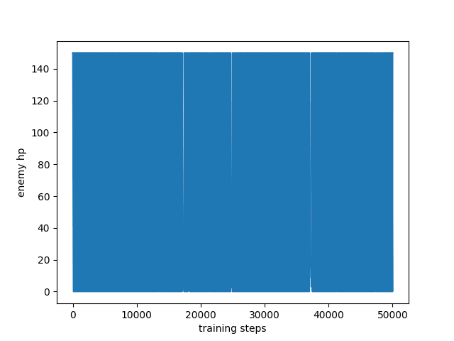
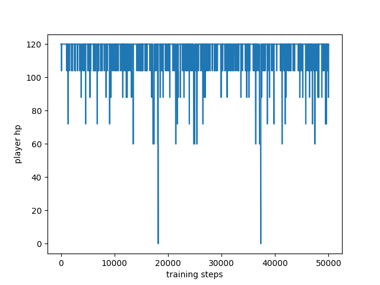
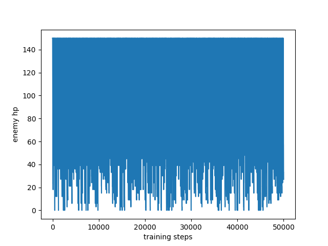
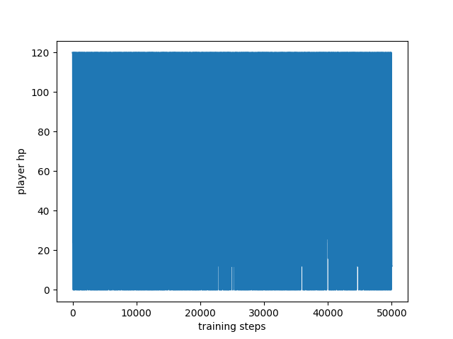
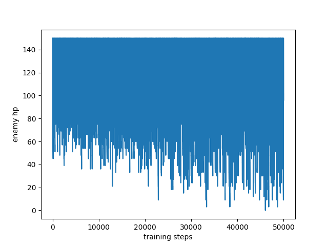
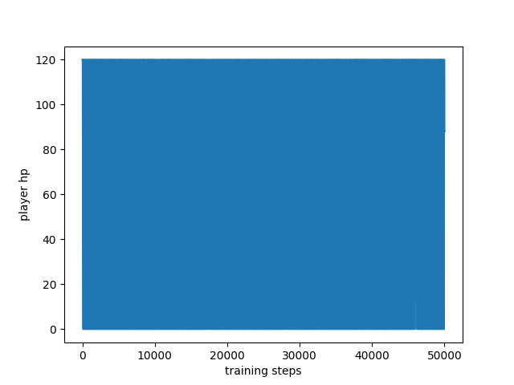

#### About
This is a project of creating a Starcraft 2 bot applying reinforcement learning

You can find three agents applied with three different algorithm: DQN, DDPG, and NEAT. There is also a scripted bot avaialbe.

All the mini maps used in this project can be found in the maps folder <br>
You can also find some pretrained models in the models folder


#### Environment:
>Python 3 

>Tensorflow 1.8.0

>Neat-python 0.92

#### Installation
1. Clone this repository
```
git clone https://github.com/zxcvbnmditto/StarCraft2-Happy-Kitting.git
```
2. Install pysc2 manually (pysc2 just got updated so pip3 doesn't give you the latest version yet) 
```
Find the folder where you python3 package is and download/replace the pysc2 folder from 

https://github.com/deepmind/pysc2
```
3. Install the required packages if needed using pip
```
pip3 install <package-name>
```
4. Move the HappyKiting3V2.SC2Map to the Starcraft 2 minimap folder.
```
Application/StarCraft II/Maps/mini_games (MacOS)
~/StarCraft II/Maps/mini_games (Linux)
```
#### Running
1. Navigates to the directory that you are interested tha most and run the following line in the terminal
```
 python3 -m main
```
#### Modified the code for neat
1. Change the important flags in main.py if needed
2. Change these global variables variables to control the running time in main.py
```
Here are some most important variables that you should keep an eye on

GENERATION = 11 # num of generation
pop # num of genomes for each generation(this is in config)
GENERATION_EP = 5 # evaluate each genome by average 10-episode rewards
EP_STEP = 500  # maximum episode steps
```
3. Save, load, evaluation
```
Evaluation generates the network graph

TRAINING # training or evaluating
CONTINUE_TRAINING # Train from scratch or from previous checkpoints
CHECKPOINT # this number is used to specified where the saved neat model should be restored for evaluation or continue training
```
4. You may also change the parameters in config file (If u know the effect)
5. Currently, the checkpoint file is set to be saved automatically after each generation. You can modify it by changing the number of this line
```
pop.add_reporter(neat.Checkpointer(<num-can-be-changed>))
```
6. Fitness function in main.py
7. Reward in agent.py

#### Results
We will evaluate our result using leftover enemy hp in each episodes and calculate the average.  

Rank by winning rate: 
> scipted (99.44%) > dqn (7.59%) > ddpg (0.27%)

Rank by average leftover sum of enemy's hp:
> scripted (106.047) > dqn (25.056) > ddpg(49.275)

#### Scripted
<p align="center">
  <h2 align="center">Overview of change of enemy hp throughout 500000 steps <br>
   <br>
  <h2 align="center"> Overview of change of player hp throughout 500000 steps <br>
  
</p>

#### DQN
<p align="center">
  <h2 align="center">Overview of change of enemy hp throughout 500000 steps <br>
   <br>
  <h2 align="center"> Overview of change of player hp throughout 500000 steps <br>
  
</p>

#### DDPG
<p align="center">
  <h2 align="center">Overview of change of enemy hp throughout 500000 steps <br>
   <br>
  <h2 align="center"> Overview of change of player hp throughout 500000 steps <br>
  
</p>