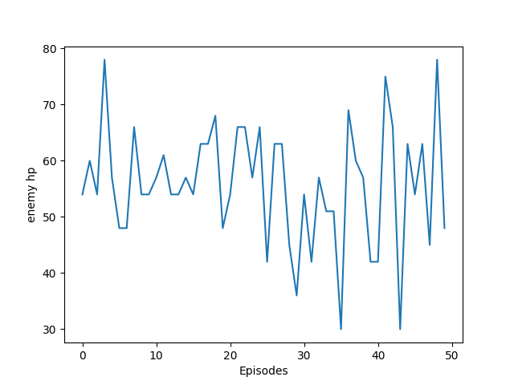
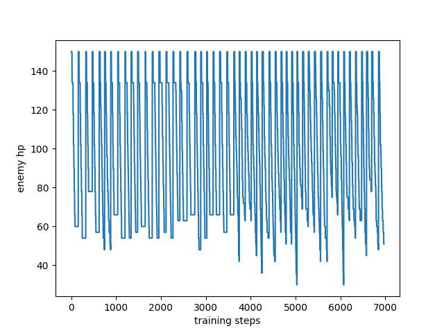
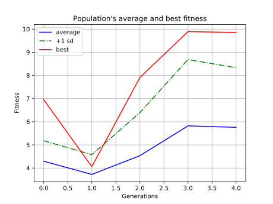

## Overview
### Neat
1. Neat hyperparameter (in config and find more information at [neat-python](http://neat-python.readthedocs.io/en/latest/config_file.html))
```
pop_size = 25 # size of the population for each generation
fitness_threshold = 1 # terminates the training if found a fitness value larger than the fitness_threshold
max_stagnation       = 3 # number of generation to discard a species if no improvement has been shown
species_elitism      = 2 # maximum species to protect from extinction
elitism            = 2 # protect the number of population in each species
survival_threshold = 0.2 # survival rate of the population for each generation
```

2. Specifies the steps (in main.py)
```
EP_STEP = 400  # maximum number of steps for each episodes
GENERATION_EP = 2  # evaluate each genome by the performance of the average n episodes
```

### Important global variables
1. Change the following 2 flags to run the program successfully (main.py)
```
# specifies the agent file that you are running
flags.DEFINE_string("agent", "agent.SmartAgent",
                    "Which agent to run")

# specifies the map that you want to test on 
flags.DEFINE_string("map", 'HK2V1', "Name of a map to use.")
```
2.  Change the option of save_pic to save graphs properly (main.py)
```
CHECKPOINT = 300 # specify the starting generation
TRAINING = True  # training 
EVALUATING = True # evaluating generates the network graphs
SAVE_PIC = True # save the generated graphs ar graphs/
```

3. Change the important map info (in ddpg_agent.py)
 ```
DEFAULT_ENEMY_COUNT # set to 2 as default
DEFAULT_PLAYER_COUNT # set to 1 as default
ENEMY_MAX_HP # set to 150 as default
PLAYER_MAX_HP # set to 60 as default
```

#### Results
Temporarily closed

#### Updates
All models would be updated and retrained. Please be patient for the improved version of the kitting bot.

<!--
## Result
In 500 generations

Best winning rate: 0%

Best average leftover sum of enemys' hp  = 55.74 (gen 306)

<p align="center">
  <h2 align = "center"> Leftover enemy hp of the best generation <br>
  
</p>


<p align="center">
  <h2 align = "center">Overview of change of enemy hp of the best generation <br>
  
</p>

<p align="center">
  <h2 align="center"> Fitness change throughout generations 300 - generation 500 <br>
  
</p>
-->