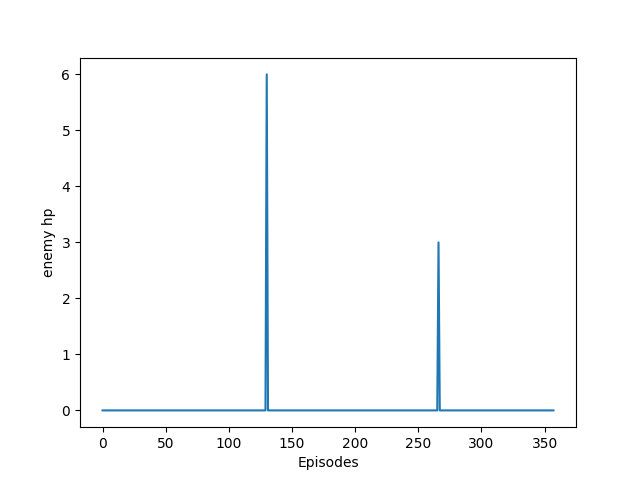
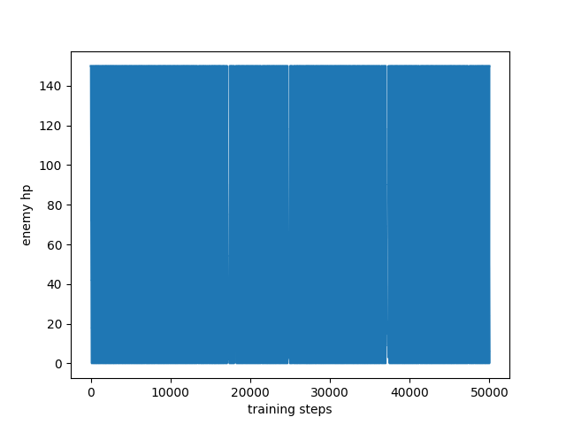

## Overview
### Important global variables
1. Change the following 3 flags to run the program successfully (main.py)
```
# specifies the agent file that you are running
flags.DEFINE_string("agent", "ddpg_agent.SmartAgent",
                    "Which agent to run")

# specifies the map that you want to test on 
flags.DEFINE_string("map", 'HK2V1', "Name of a map to use.")

# specifies the maximum step count for this run
flags.DEFINE_integer("max_agent_steps", 50000, "Total agent steps.")
```
2.  Change the option of save_pic to save graphs properly (main.py)
```
SAVE_PIC = True # save the generated graphs ar graphs/
```

3. Change the important map info (in ddpg_agent.py)
 ```
DEFAULT_ENEMY_COUNT # set to 2 as default
DEFAULT_PLAYER_COUNT # set to 1 as default
ENEMY_MAX_HP # set to 150 as default
PLAYER_MAX_HP # set to 60 as default
```

## Result
In 500000 steps

Winning rate: 99.44%

Average leftover sum of enemys' hp  = 0.025

Average leftover sum of player's hp: 106.047

<p align="center">
  <h2 align = "center"> Leftover enemy hp in each episodes <br>
  
</p>


<p align="center">
  <h2 align = "center">Overview of change of enemy hp throughout 500000 steps <br>
  
</p>

<p align="center">
  <h2 align="center"> Overview of change of player hp throughout 500000 steps <br>
  
</p>